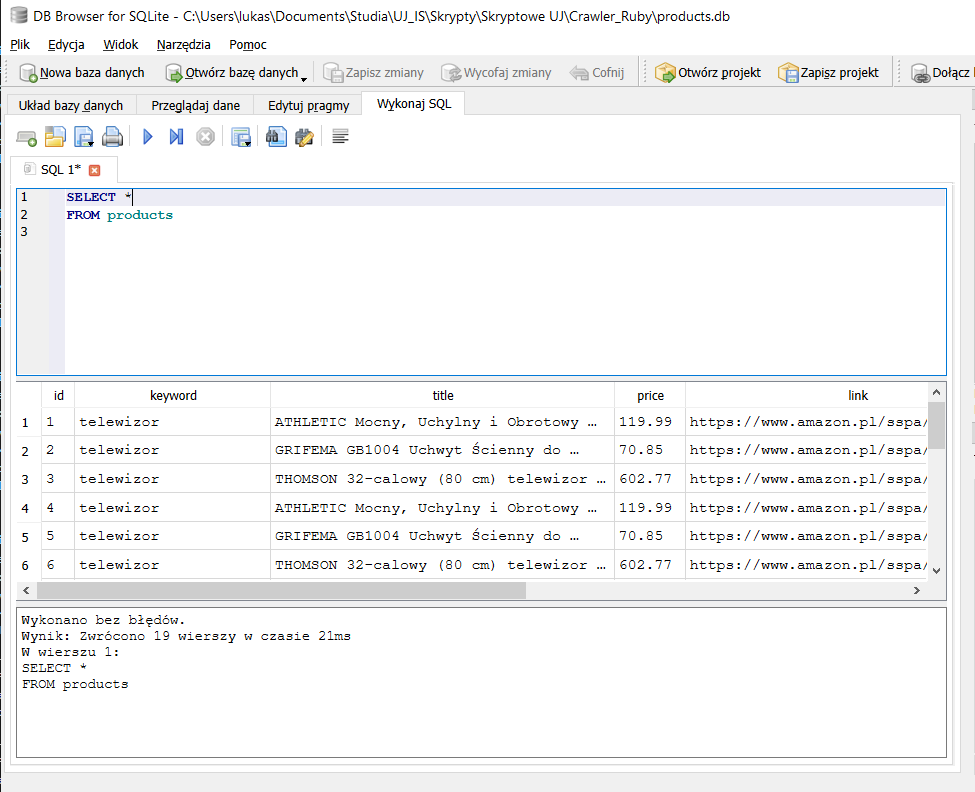

## Zadanie4: Crawler_Ruby
  

**1. Opis projektu**
* **Nazwa:** Ruby. Crawler
* Program umożliwia:

    * [3.0] Należy pobrać podstawowe dane o produktach (tytuł, cena), dowolna kategoria

    * [3.5] Należy pobrać podstawowe dane o produktach wg słów kluczowych

    * [4.0] Należy rozszerzyć dane o produktach o dane szczegółowe widoczne tylko na podstronie o produkcie

    * [4.5] Należy zapisać linki do produktów

    * [5.0] Dane należy zapisać w bazie danych np. SQLite via Sequel


**2. Sposób użycia**

```
    ruby main.rb "konsola playstation 5", 5
```

>HTTP status: 200
>
>Found 67 product cards
>
>Scraped 5 products for keyword: konsola playstation 5
>
>Data saved to database.


**3. Rezultat działania**

* [SQL query result](rezultat/db_result_2.json)

